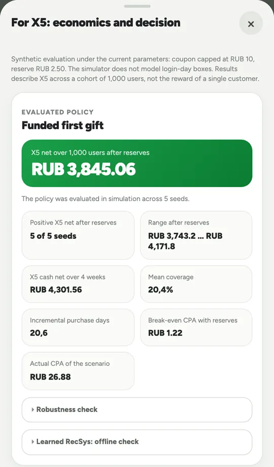
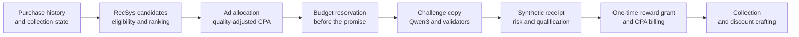

<div align="center">


# X5 Checkpoint

### Multi-objective Recommendation & Ad Allocation for Retail Loyalty

One personalized shopping challenge, selected for customer relevance, expected retailer value, and available reward funding.

*Next-best-action ranking · quality-adjusted CPA auction · offline uplift modeling · validated LLM copy*


<a href="https://github.com/m4themagics/x5-loyalty-system/actions/workflows/ci.yml"></a>
<br/>


</div>

A three-person X5 hackathon project connecting a collectible-item game to a local RecSys/Ads decision engine. **The application serves a rules-based policy; the learned policy is evaluated offline on randomized synthetic logs.** All purchases, campaigns, billing, and reward entitlements are demonstrational.

<div align="center">

| Open a reward box | Craft a discount |
| :---: | :---: |
|  |  |

**Reward box → digital item → collection → combine four items → discount**

</div>

## Problem

A retail promotion can reward a purchase that would have happened anyway. Optimizing response or reach alone can therefore increase reward costs without enough incremental margin to cover them.

**X5 Checkpoint** explores this tradeoff through a playable loyalty prototype. Customers collect digital kitchen items and combine four item instances into a discount. The decision engine selects **one next shopping challenge** subject to relevance, eligibility, risk, inventory, campaign budgets, and expected economics. It reserves the maximum reward liability before displaying a promise; when no candidate qualifies, it returns `no_action` and preserves earned rewards.

The first eligible, completed sponsored challenge grants a promised digital item and a demo entitlement to one free physical SKU. Later digital challenges may be organic. Physical fulfillment and real advertiser accounts are outside the local prototype.

## Results on Synthetic Data

<table align="center">
<tr>
<td align="center"><h3>+3,845 RUB</h3>mean simulated retailer net<br/>1,000 users, four weeks, after liability growth</td>
<td align="center"><h3>5 / 5</h3>positive simulation seeds<br/>range: +3,743 to +4,172 RUB</td>
<td align="center"><h3>1.22 RUB</h3>simulated break-even CPA<br/>vs. 26.88 RUB mean simulated CPA</td>
</tr>
<tr>
<td align="center"><h3>60 / 60</h3>invalid card mutations rejected<br/>0 false positives across 24 valid variants</td>
<td align="center"><h3>40 / 40</h3>eligible decisions passed the rubric<br/>plus 8/8 expected refusals</td>
<td align="center"><h3>249</h3>automated tests<br/>contracts, webapp, engine, and evaluation</td>
</tr>
</table>

These are reproducible simulation and test results, with fixed seeds and explicit assumptions. The 40-profile relevance check covers post-onboarding digital decisions against an `agent_draft` rubric that has not been validated by human experts. These results do not establish real customer demand, causal lift, or X5 profitability. See [Experiments](#experiments) and [Validation](#validation) for commands and evidence.

## RecSys & Ads Components



**Next-best-action recommendation.** Enumerate missing-item × recipe candidates over the full, small catalog. Apply eligibility checks for purchase history, SKU availability, risk, frequency, funding, and minimum expected net value. Rank accepted candidates lexicographically by the selected recipe, familiar purchase days, recipe completion, collection progress, purchase recency, and expected net value, with a stable ID as the tie-breaker. Return reasons for accepted and rejected candidates. Runtime estimates come from configured rules.

**Ad allocation and billing.** A closed, quality-adjusted first-price cost-per-action (CPA) auction ranks eligible campaigns by *paced quality-adjusted expected payment + expected incremental X5 margin − uncovered reward cost*. Bids are supplied by campaigns. Pacing changes allocation priority while the winner pays its submitted bid. Reserve **bid + subsidy before display**; charge once after a fresh, verified qualifying event.

**Offline learned policy.** Separate treatment and control logistic regressions estimate uplift, followed by isotonic calibration and a separate billable-event model. Implemented with Python's standard library and trained on randomized synthetic logs. Held-out calibrated uplift RMSE is **0.0637**, versus **0.0680** before calibration; billable-event AUC is **0.802**. This model is not connected to application serving.

**Validated LLM copy.** Qwen3 1.7B via Ollama generates challenge titles and collection titles; factual card fields are constructed by the system. Validators constrain the text to approved terms and reject invented prices or SKUs, changed deadlines, causal promises, released fraud holds, and omitted sponsorship disclosures. Card mutation tests reject **60/60** invalid variants and accept **24/24** valid ones. Unavailable or invalid model output uses a deterministic fallback.

**Reward economics and risk.** Integer kopecks, a shared coupon fund, and full maximum-liability reserves before promises are shown. Physical rewards and advertiser budgets are tracked separately. Scenario-based fraud scoring produces `allow`, `review`, `hold`, or `reject`; an independent synthetic evaluation compares thresholds using expected loss and false-block costs.

<br clear="all" />

## Decision Flow



A versioned Zod contract defines the webapp ↔ Python boundary. Vite development middleware validates the wire payloads and invokes a fixed Python command; the engine uses JSON over stdin/stdout. State and budget ledgers remain local to the browser.

## Screens

The original retail demo and captured UI are in Russian; captions and technical documentation are in English.

<div align="center">

| Home | Personalized challenge | Reward |
| :---: | :---: | :---: |
|  |  |  |
| Pyaterochka-style navigation | Terms, deadline, reward, and sponsor | Item rarity and associated category |

| Collection | Friends | Active discount |
| :---: | :---: | :---: |
|  |  |  |
| 24 items, three rarities, seven recipes | Rank by collected sets and items | 5–17% discount and demo EAN-13 barcode |

</div>

## Experiments

**Paired policy simulation:** 1,000 synthetic users, four weeks, five seeds. The table shows means across seeds. Conservative net equals four-week cash net minus growth in outstanding maximum coupon liabilities.

| Policy | Coverage | Incremental purchase days | Conservative retailer net (RUB) |
| --- | ---: | ---: | ---: |
| **Funded first gift** | 20.4% | +20.6 | **+3,845.06** |
| Broad personalized selection | 96.5% | +109.0 | −7,996.44 |
| Fixed category | 6.8% | +4.6 | +1,024.88 |
| Same reward and terms, without the game | 20.4% | +16.4 | +3,436.90 |

In this simulated setting, broader coverage produces more purchase days and a negative net result. The comparison illustrates why eligibility and funding constraints belong in the decision policy. The assumed game effect remains a hypothesis for a real experiment.

**Offline learned-policy comparison:** policies evaluated on the same held-out synthetic users, using simulated outcomes and a separate cohort-net metric. These results are a different experiment from the four-week table above.

| Policy | Incremental purchases | Simulated cohort net (RUB) |
| --- | ---: | ---: |
| **Learned profit-gated** | +271 | **+18,665.20** |
| Rules profit-ranked | +210 | +16,723.60 |
| Runtime-style rules baseline | +287 | +13,533.60 |
| Fixed dairy | +87 | −6,790.60 |

The profit-ranked rules baseline adds **RUB 3,190.00** over the runtime-style baseline; the learned policy adds a further **RUB 1,941.60**. This ablation separates the change in ranking objective from the additional contribution of learned estimates. The runtime-style baseline adapts the application rules to the offline candidate representation; it is not a replay of live serving.

Committed reports: [paired simulation](recsys/eval/results/policy-comparison.json), [learned policy](recsys/eval/results/learned-recsys.json). Reproduce the two experiments without overwriting the reports:

```bash
python3 recsys/eval/compare_policies.py
python3 recsys/eval/learned_recsys.py
```

See the [evaluation methodology](recsys/eval/README.md) for seeds, baselines, null/adverse scenarios, and limitations.

## Code to Review

| File | Engineering focus |
| --- | --- |
| [recsys/engine/candidates.py](recsys/engine/candidates.py) | Candidate enumeration, eligibility, lexicographic ranking, and rejection reasons |
| [recsys/engine/ads.py](recsys/engine/ads.py) | Auction filters, quality-adjusted scores, bid reservation, and billing decisions |
| [recsys/engine/economics.py](recsys/engine/economics.py) | Integer-money accounting, shared coupon fund, and maximum-liability reserves |
| [recsys/engine/event.py](recsys/engine/event.py) | Receipt qualification and idempotent reward and billing intent |
| [recsys/eval/learned_recsys.py](recsys/eval/learned_recsys.py) | Treatment/control models, calibration, billable-event prediction, and policy evaluation |
| [packages/contracts/src/demo-poc.ts](packages/contracts/src/demo-poc.ts) | Versioned request/response schemas at the webapp ↔ Python boundary |
| [webapp/src/features/home/](webapp/src/features/home/) | Collection, crafting, reward integration, exchange, and the retailer evaluation panel |

## Run Locally

Requires Bun 1.4.0 and Python 3.9+ available as `python3`.

```bash
git clone https://github.com/m4themagics/x5-loyalty-system.git
cd x5-loyalty-system
bun install --frozen-lockfile
bun --bun run --cwd webapp dev
```

Open [localhost:5173](http://localhost:5173) and select the profile tab at the bottom right. Use the Vite **development server** for the integrated RecSys/Ads flow: a static production preview does not expose the Python demo API.

Ollama is optional. For local model output, run Ollama and pull `qwen3:1.7b` with `ollama pull qwen3:1.7b`. If the model is unavailable, the card uses a validated template and reports `source: "fallback"`.

<details>
<summary><strong>Three-minute walkthrough</strong></summary>

**Collection and crafting.** Open the profile, press the box, then hold and move the pointer rapidly from side to side to reveal an item. Collect it. The current accelerated demo allows repeated box openings while the coupon fund can reserve another item. In the collection tab, place four owned item instances into the slots and create a discount to inspect its percentage, monetary cap, and demo barcode.

**Recommendation and Ads.** Open the challenges tab and request a challenge. Use the demo controls to choose a synthetic profile and submit a qualifying receipt; collect the promised reward. The retailer panel shows decision reasons, the selected campaign, budget reserves, one-time CPA billing, and policy comparisons. A profile seeded with three matching items demonstrates recipe completion after one challenge; an empty inventory still needs four item instances to craft.

**Item exchange.** Select the Anya trade profile, open the exchange control beside the mascot, choose an item, and create an offer. Switch to the Boris trade profile and accept it.

</details>

<details>
<summary><strong>Game mechanics</strong></summary>

- 24 items: eight common, eight epic, and eight legendary. Random boxes select rarity with weights of 70% / 25% / 5%, then an item uniformly within that rarity.
- Seven recipes; combining four item instances yields a 5–17% discount with the current catalog. The formula has an 18% cap.
- The current build enables an accelerated box-opening mode. The retained login mechanism uses three distinct Moscow calendar days and a four-claims-per-28-days limit; the demo override skips that wait.
- One active coupon, a structurally valid demo EAN-13 barcode, and browser-local inventory and coupon state.
- Two owned items can be equipped on the mascot; appearance does not change discount value.
- Same-rarity 1:1 item exchange, a 24-hour expiry, two verified purchase days per participant, and at most three completed trades per user per week.
- Friends are ranked by collected sets and items. Redeemed savings remain private.
- Challenge and box rewards enter the same inventory. Current code reserves **RUB 2.50 per item instance** toward a coupon capped at **RUB 10**. Physical reward funding is separate.

</details>

## Validation

**249 automated tests:** 11 contract, 111 webapp, 86 decision-engine, and 41 evaluation tests. Card mutation checks run separately. [CI](.github/workflows/ci.yml) runs these checks for pushes to `main` and pull requests targeting `main`, together with type checking, linting, and a web build.

```bash
bun run check            # Types, lint, unit tests, engine/evaluation tests, validators
bun run test             # 11 contract + 111 webapp tests
bun run test:engine      # 86 engine tests
bun run test:eval        # 41 evaluation tests
bun run validate:recsys  # Scenario schemas, explanation contracts, 60 card mutations
python3 recsys/eval/run_relevance.py  # 40 eligible profiles + 8 expected refusals
```

Browser journeys run separately with `bun run e2e:demo`. README screenshots and animations are captured from the application with `bun run docs:shots`.

## Architecture

| Component | Responsibility |
| --- | --- |
| React 19, TypeScript, Vite, Tailwind 4 | Mobile browser UI, collection, crafting, exchange, and local state |
| Python standard library | Recommendation, auction, reward economics, risk scoring, and event verification |
| Zod contract v2 | Validated webapp ↔ engine wire boundary |
| Qwen3 1.7B via Ollama | Challenge wording and collection titles within system-defined constraints |
| Playwright + Bun tests + Python unittest | Browser journeys, contract tests, business rules, and evaluation checks |

## Team & Contribution

Built by a three-person team for the X5 hackathon. The [recorded ownership split](docs/project/plan.md) assigns **RecSys/Ads, data, and analytics to @m4themagics**: action selection, baselines, explanations, SKU economics, auction logic, and reproducible evaluation. Game implementation and screen integration are assigned to @grigorii_zor; product research and design to @yungatla. The concept and final integration were collaborative.

## Scope & Next Steps

The prototype runs on one laptop with browser-local ledgers and synthetic profiles, purchases, products, campaigns, and responses. It demonstrates decision and accounting mechanics under explicit assumptions. Local state can be edited by the browser user; real fulfillment, POS integration, protected server ledgers, production advertiser accounts, and models trained on X5 data are not connected.

A real pilot would require SKU-level costs and margins, server-owned entitlements and budgets, verified POS events, secure redemption, and a randomized experiment against an offer with the same reward and terms. Recommendation relevance, reward desirability, the added effect of the game, and paid purchase persistence need separate measurement.

## Documentation

| Document | Contents |
| --- | --- |
| [RecSys/Ads overview](recsys/README.md) | Runtime engine, offline modeling, and evidence boundaries |
| [Decision engine](recsys/engine/README.md) | Candidate selection, ad allocation, economics, and event handling |
| [PoC contract](recsys/contract/README.md) | Webapp ↔ Python boundary and reference payloads |
| [Evaluation](recsys/eval/README.md) | Experimental design, baselines, results, and reproduction commands |
| [Implementation status](docs/project/poc-status.md) | Implemented capabilities and remaining limitations |
| [Webapp](webapp/README.md) | UI scope, setup, and browser checks |
| [Documentation index](docs/README.md) | Technical docs and original Russian product specifications and submission materials |

The original case brief, detailed product specifications, and archived hackathon submission remain in Russian. Current code and the English implementation/evaluation docs establish what the prototype runs today.

## License

[Apache 2.0](LICENSE). Pyaterochka and X5 names and visual assets appear in an educational demo and belong to their respective rights holders.
