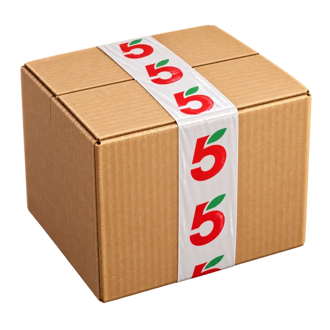
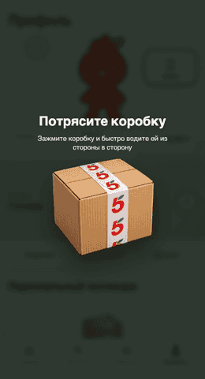
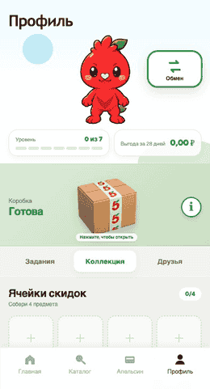
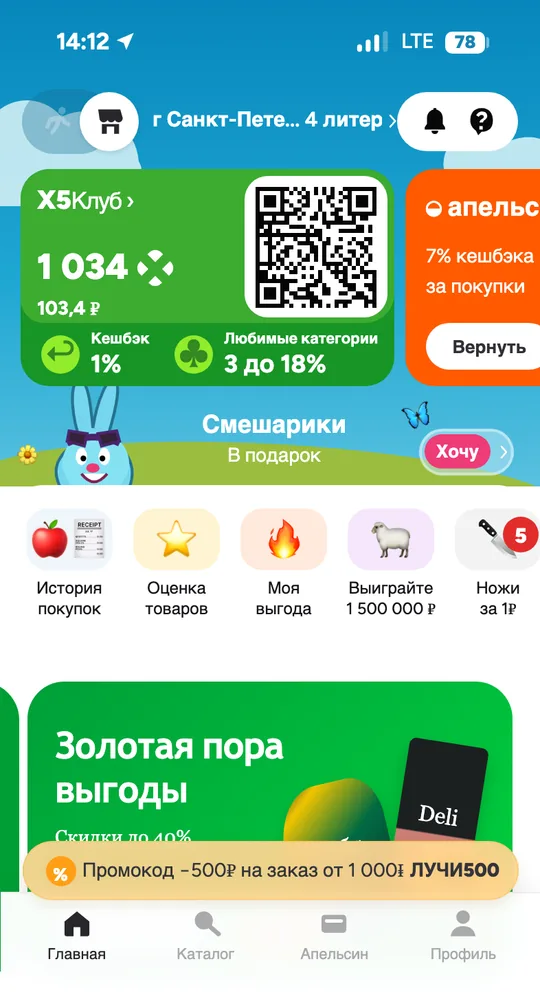
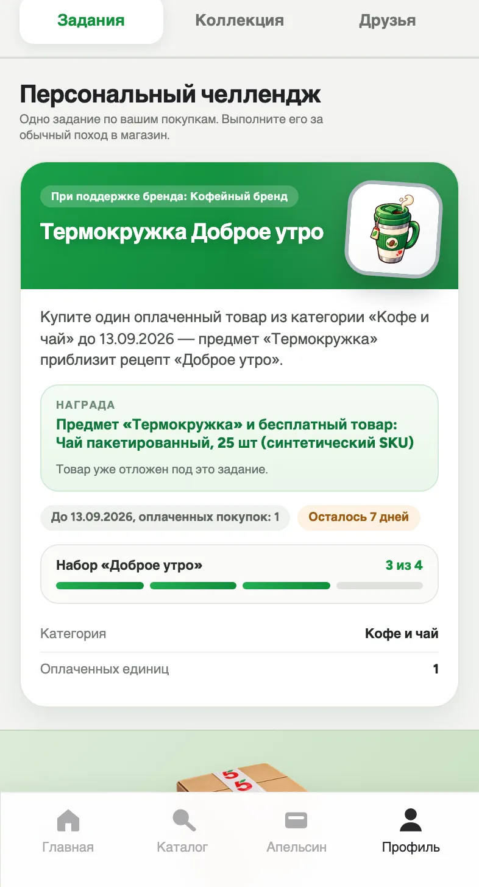
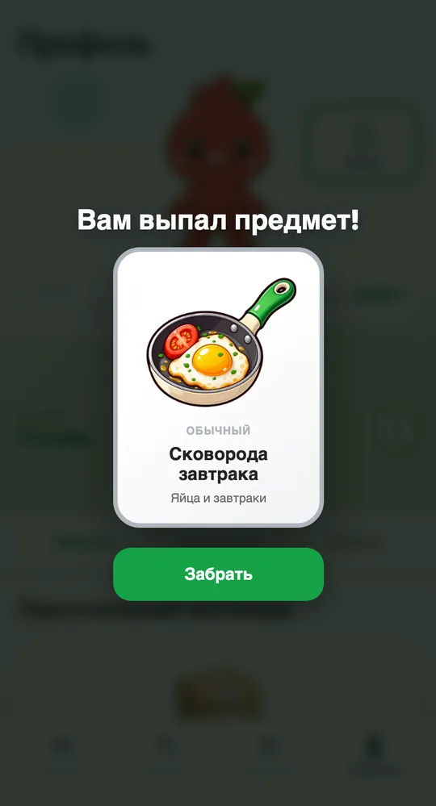
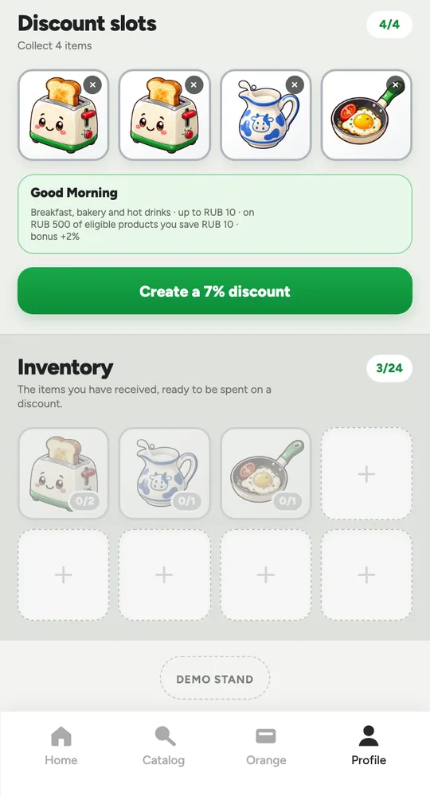
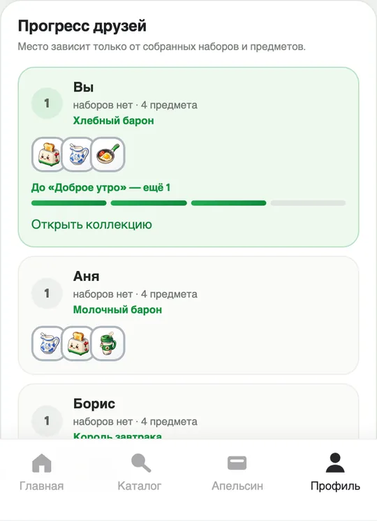
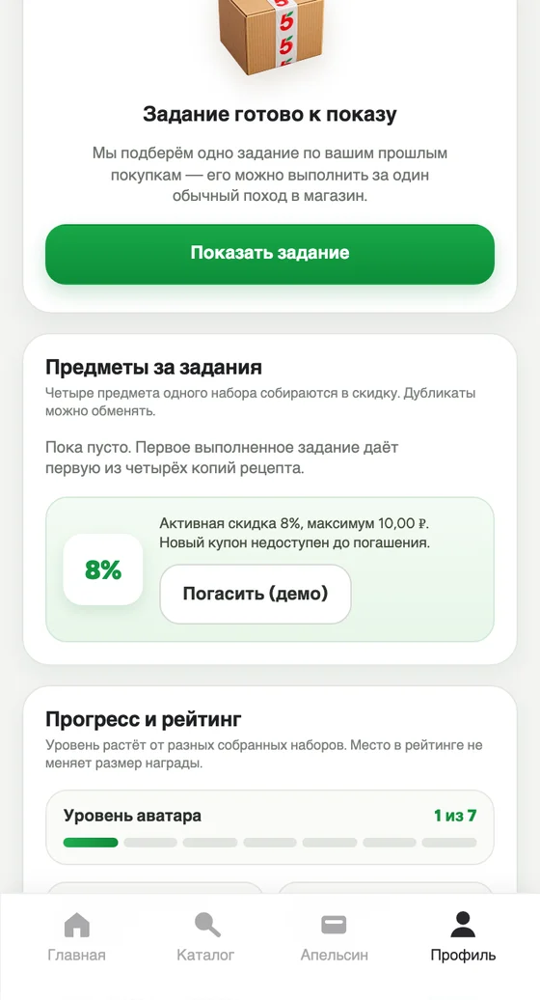

<div align="center">



# X5 Чекпоинт

### Собирай свою выгоду

Игра для приложения «Пятёрочки», в которой обычные покупки помогают собрать собственную скидку.<br/>
Пользователь получает цифровые кухонные предметы, находит тематические сочетания и выбирает интересную ему выгоду.

**Коробка → предмет → коллекция → четыре предмета → скидка**


<a href="https://github.com/m4themagics/x5-loyalty-system/actions/workflows/ci.yml"></a>


</div>

<div align="center">

| Открыть коробку | Собрать скидку |
| :---: | :---: |
|  |  |
| Коробка открывается встряхиванием — предмет попадает в инвентарь | Четыре предмета превращаются в собственную скидку |

</div>

## О проекте

В игре **24 предмета, три редкости и семь рецептов**. Например, тостер, молочный кувшин, термокружка и сковорода образуют «Доброе утро». Персональное задание помогает получить недостающий предмет; первый выполненный допустимый челлендж в целевой программе также приносит конкретный бесплатный товар.

Репозиторий содержит **локальный веб-прототип** с игровой песочницей и персональным сценарием на синтетических покупках. Товарные награды и погашение скидки демонстрационные.

## Экраны

<div align="center">

| Главная | Персональное задание | Награда |
| :---: | :---: | :---: |
|  |  |  |
| Знакомый интерфейс «Пятёрочки» | Условие, срок, награда и спонсор задания | Предмет с редкостью и категорией |

| Коллекция | Друзья | Активная скидка |
| :---: | :---: | :---: |
|  |  |  |
| Общий инвентарь и четыре ячейки | Титулы и сравнение по собранному | Готовая скидка и демонстрационный штрихкод |

</div>

<details>
<summary><strong>Что уже работает</strong></summary>

Игровая коллекция и персональное задание связаны в одном локальном демо.

### Игровой профиль

- адаптированная под телефон главная страница и переход в профиль;
- маскот, уровень `0–7`, выгода за 28 дней и значок активной скидки;
- маскот меняет позу под происходящее: моргает в покое, ждёт во время расчёта решения
  и радуется после закрытия окна награды;
- два предмета каталога надеваются на него как косметика: фартук пекаря и нож шефа.
  На размер скидки внешний вид не влияет;
- коробка, которая открывается после движения пальцем или указателем по экрану;
- коробка за три разных дня входа, максимум четыре за последние 28 дней; пропуск не сбрасывает прогресс;
- 24 предмета: 8 обычных, 8 эпических и 8 легендарных;
- вероятности редкости: 70% / 25% / 5%, затем равномерный выбор предмета внутри редкости;
- локальный инвентарь с количеством копий и карточками-подсказками;
- четыре ячейки скидки, заполнение нажатием или перетаскиванием;
- семь тематических рецептов и скидка по фактической формуле от 5% до достижимых 17% (программный предел — 18%);
- один активный демо-купон с EAN-13 штрихкодом;
- четыре статических задания недели;
- локальный обмен 1:1 между подготовленными профилями, вкладка друзей и рейтинг по собранным наборам и предметам;
- титул коллекции от LLM с проверкой текста и запасным шаблоном.

Инвентарь, коробка и активная скидка хранятся в `localStorage`. Штрихкод не подключён к кассе, не имеет серверного погашения и не создаёт реальную скидку.

### Персональный PoC

В режиме разработки Vite передаёт синтетическую историю покупок и состояние профиля в локальный Python-движок. Он:

1. выбирает одно допустимое задание правилами RecSys;
2. проводит локальный Ads-аукцион для первого физического подарка;
3. передаёт решение Qwen3 1.7B или безопасному шаблону;
4. проверяет синтетический чек, риск и повтор события;
5. один раз записывает цифровую награду, демонстрационное право на товар и CPA-биллинг;
6. показывает объяснение решения и синтетическую оценку на экране «Для X5».

Награда персонального задания показывается отдельным полноэкранным окном и попадает в ту же «Коллекцию», что и предмет из коробки: инвентарь и четыре слота сборки в продукте одни. Каждый экземпляр — и выпавший из коробки, и выданный за задание — удерживает резерв 2,50 ₽ под будущий купон до 10 ₽. Резерв коробки создаётся перед показом прогресса и переходит предмету без повторного удержания. Бюджет демо не увеличен; старая коллекция сохраняется с пересчётом обеспечения, старые купоны — со своим максимумом.

</details>

## Быстрый старт

Нужны Bun и Python 3.9+.

```bash
git clone https://github.com/m4themagics/x5-loyalty-system.git
cd x5-loyalty-system
bun install --frozen-lockfile
bun --bun run --cwd webapp dev
```

Откройте [localhost:5173](http://localhost:5173) и нажмите «Профиль». Если Vite выбрал другой порт, используйте адрес из терминала.

Ollama необязательна: без неё персональная карточка использует проверенный шаблон. Для локального Qwen:

```bash
brew install ollama
brew services start ollama
ollama pull qwen3:1.7b
```

## Как показать демо

### 1. Коробка и собственная скидка

1. Откройте «Профиль».
2. В «Демо-стенде» дважды нажмите «Следующий день входа (демо)» и закройте стенд: первый день уже засчитан при входе. В реальном сценарии нужны три разных дня по Москве.
3. Нажмите на готовую коробку, зажмите её и быстро водите из стороны в сторону.
4. Нажмите «Забрать» — предмет уже добавлен в «Коллекцию».
5. Для следующей коробки нужны ещё три разных дня; лимит — четыре получения за 28 дней. Для быстрого крафта можно выбрать явно подготовленный профиль.
6. В «Коллекции» перенесите или выберите четыре предмета и нажмите «Создать скидку».
7. Покажите процент, потолок 10 ₽, пример фактической экономии и демо-штрихкод.

### 2. Персональное задание и AI/Ads

1. На вкладке «Задания» нажмите «Показать задание».
2. Откройте «Демо-стенд», выберите синтетический профиль и отправьте подходящий тестовый чек.
3. Покажите отдельное окно награды и нажмите «Забрать».
4. В «Для X5» покажите причины решения, кампанию, резерв, однократный CPA и синтетические сравнения политик.

### 3. Обмен

В «Демо-стенде» выберите профиль «Аня», затем откройте кнопку «Обмен» рядом с маскотом. Выберите свой предмет, покажите QR, создайте предложение и переключитесь на «Бориса» для принятия. QR и соединение участников демонстрационные; передача выполняется между локальными синтетическими профилями.

## Архитектура

| Часть | Назначение |
| --- | --- |
| React 19, TypeScript, Vite | Мобильный интерфейс, коробка, коллекция, крафт, обмен и локальное состояние |
| Python, rules-based RecSys | Выбор задания, проверка синтетического чека, риск и экономика |
| Локальный Ads-аукцион | Отбор кампании, резервирование и однократный first-price CPA |
| Qwen3 1.7B через Ollama | Заголовок карточки и титул коллекции с проверкой текста; условия и награды фиксирует система |
| Zod contract v2 | Проверяемый JSON-контракт между webapp и Python |
| Offline learned RecSys | Эксперимент на рандомизированной синтетике; не используется в runtime |

Backend, база данных, авторизация, POS, реальные покупатели, реальные бюджеты рекламодателей и промышленная выдача наград отсутствуют.

### С чего начать чтение

| Файл | Что там |
| --- | --- |
| [recsys/engine/ads.py](recsys/engine/ads.py) | Ads-аукцион: жёсткие фильтры до скоринга, quality-adjusted ранжирование, резерв ставки и однократное списание после подтверждённого события |
| [recsys/engine/candidates.py](recsys/engine/candidates.py) | Выбор следующего задания: перебор пар «недостающий предмет × рецепт», допуск по истории, остаткам, бюджету и экономике |
| [recsys/engine/economics.py](recsys/engine/economics.py) | Целочисленные копейки, общий купонный фонд, полные максимальные резервы и адаптер каталога кампаний к аукциону |
| [recsys/eval/learned_recsys.py](recsys/eval/learned_recsys.py) | Offline-эксперимент: two-model uplift на логрегрессии, изотоническая калибровка и модель billable-события без внешних зависимостей |
| [packages/contracts/src/demo-poc.ts](packages/contracts/src/demo-poc.ts) | Zod-контракт v2 — единственная граница между webapp и Python |
| [webapp/src/features/home/](webapp/src/features/home/) | Игровой профиль: коробка, инвентарь, крафт скидки, обмен и панель «Для X5» |

## Проверки

Проверены 11 контрактных, 108 web-тестов, 84 теста Python-движка и 41 аналитический тест. Браузерные сценарии обновлены; повторный запуск Playwright заблокирован разрешением среды. Скриншоты показывают предыдущую версию.

```bash
bun run test
bun run test:engine
bun run test:eval
bun run validate:recsys
bun run typecheck
bun run lint
bun run build
```

Скриншоты и анимации в этом файле снимаются с работающего приложения, а не рисуются вручную:

```bash
bun run docs:shots
```

Команда поднимает dev-сервер, проходит демонстрационный маршрут и пересобирает
`docs/assets/screenshots/`. Запускайте её после заметных изменений интерфейса.

## Границы PoC

Все профили, чеки, кампании, цены и эффекты синтетические. Расчёты подтверждают воспроизводимость логики, но не доказывают рост покупок или прибыль X5. Для пилота нужны реальные SKU и маржа, серверный журнал прав и бюджетов, POS-события, защищённое погашение и A/B-тест с одинаковыми условиями награды.

## Документация

| Материал | Содержание |
| --- | --- |
| [Описание проекта](docs/project/project-description.md) | Концепция, фактический статус и целевые правила |
| [Каталог предметов](docs/project/item-pool.md) | Все 24 предмета, редкости, рецепты и формула скидки |
| [Статус PoC](docs/project/poc-status.md) | Что проверено и какие ограничения остаются |
| [Контракт PoC](recsys/contract/README.md) | Граница webapp ↔ Python и примеры payload |
| [Оценка](recsys/eval/README.md) | Синтетические эксперименты и ограничения выводов |

## Лицензия

[Apache 2.0](LICENSE). Названия и визуальные элементы «Пятёрочки» и X5 используются в учебном демонстрационном прототипе и принадлежат правообладателям.
