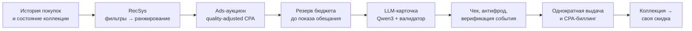

<div align="center">


# X5 Чекпоинт

### Игровая лояльность как задача многокритериальной оптимизации

Персональное задание, которое одновременно попадает в интерес покупателя, окупается для сети и оплачивается брендом.

*Multi-objective next-best-action RecSys · closed CPA ad auction · guard-railed LLM copy · full liability reserve — in one reproducible prototype.*


<a href="https://github.com/m4themagics/x5-loyalty-system/actions/workflows/ci.yml"></a>
<br/>


</div>

<div align="center">

| Открыть коробку | Собрать свою скидку |
| :---: | :---: |
|  |  |

**Коробка → предмет → коллекция → четыре предмета → скидка**

</div>

---

## Задача

Массовые промо дают охват, но не окупаемость: скидку получают и те, кто купил бы и так. Персонализация без экономики просто раздаёт деньги быстрее.

**X5 Чекпоинт** решает это иначе: покупатель собирает коллекцию кухонных предметов и сам крафтит из них скидку, а система под капотом на каждом шаге выбирает **одно** задание, которое проходит четыре фильтра сразу — релевантно человеку, выполнимо за один обычный поход в магазин, приносит сети положительную маржу и полностью профинансировано рекламодателем до того, как обещание показано.

## Результат

<table align="center">
<tr>
<td align="center"><h3>+3 845 ₽</h3>итог X5 на 1 000 пользователей<br/>за 4 недели после покрытия обязательств</td>
<td align="center"><h3>5 / 5</h3>seed с положительным итогом<br/>диапазон +3 743…+4 172 ₽</td>
<td align="center"><h3>1,22 ₽</h3>CPA безубыточности<br/>при фактической CPA 26,88 ₽</td>
</tr>
<tr>
<td align="center"><h3>60 / 60</h3>нарушений LLM-контракта поймано<br/>при 0 ложных срабатываний</td>
<td align="center"><h3>40 / 40</h3>решений RecSys приняты рубрикой<br/>и 8/8 ожидаемых отказов</td>
<td align="center"><h3>249</h3>автоматических проверок<br/>в CI на каждый push</td>
</tr>
</table>

Все числа получены на синтетической аудитории и рубриках оценщика, зафиксированы seed и воспроизводятся одной командой — см. [Проверки](#проверки).

## Что внутри


**Многокритериальный RecSys.** Полный перебор пар «недостающий предмет × рецепт», жёсткие фильтры до скоринга (история категории, наличие SKU, риск, частота, бюджет, минимальный ожидаемый прирост) и лексикографическое ранжирование по цели рецепта, знакомости категории, завершению набора, прогрессу, выполнимости и ожидаемой марже. Runtime остаётся объяснимым: каждое решение отдаёт причины отказа и принятия.

**Закрытый CPA-аукцион.** Quality-adjusted first-price: ранг = *paced quality-adjusted payment + ожидаемая маржа X5 − непокрытая стоимость награды*. Пейсинг меняет приоритет, но никогда не цену. Ставка и субсидия резервируются **до показа**, победитель платит свою ставку один раз — после подтверждённого квалифицирующего события.

**Обучаемая политика (offline).** Две логистические регрессии treatment/control → uplift, изотоническая калибровка, отдельная модель billable-события. Без внешних библиотек, на рандомизированных логах. Калиброванный uplift RMSE **0,0637** против 0,0680 сырого, billable AUC **0,802**.

**LLM под контрактом.** Qwen3 1.7B через Ollama пишет заголовок карточки и титул коллекции. Валидатор запрещает выдуманные цены и SKU, сдвиг срока, обещание причинного эффекта, снятие fraud-hold и скрытую пометку о спонсорстве: **60 из 60** мутаций пойманы, 0 ложных срабатываний на 24 легитимных вариантах, при отказе — детерминированный шаблон.

**Экономика и антифрод.** Только целые копейки, единый купонный фонд, полная максимальная ответственность резервируется до показа обещания. Скоринг риска с порогами allow / review / hold / reject, откалиброванными по стоимости ошибки, а не по метрике.

<br clear="all" />

## Как это работает



Граница между интерфейсом и движком решений — один версионированный Zod-контракт; Python-движок написан на стандартной библиотеке и говорит JSON через stdin/stdout.

## Экраны

<div align="center">

| Главная | Персональное задание | Награда |
| :---: | :---: | :---: |
|  |  |  |
| Знакомый интерфейс «Пятёрочки» | Условие, срок, награда и спонсор | Предмет с редкостью и категорией |

| Коллекция | Друзья | Активная скидка |
| :---: | :---: | :---: |
|  |  |  |
| 24 предмета, 3 редкости, 7 рецептов | Сравнение по собранному, не по тратам | Скидка 5–17% и штрихкод EAN-13 |

</div>

## Цифры экспериментов

**Сравнение политик** — 1 000 синтетических пользователей, 4 недели, 5 seed. Итог после полного покрытия прироста непогашенных обязательств:

| Политика | Охват | Дополнительные покупочные дни | Итог X5 |
| --- | ---: | ---: | ---: |
| **Финансируемый первый подарок** | 20,4% | +20,6 | **+3 845,06 ₽** |
| Широкий персональный выбор | 96,5% | +109,0 | −7 996,44 ₽ |
| Фиксированная категория | 6,8% | +4,6 | +1 024,88 ₽ |
| Те же награда и условия без игры | 20,4% | +16,4 | +3 436,90 ₽ |

Широкий охват увеличивает покупки и одновременно уничтожает экономику — поэтому продукт сознательно показывает **одно** профинансированное задание.

**Обучаемая политика против правил** — общая held-out выборка, декомпозиция вклада:

| Политика | Дополнительные покупки | Итог когорты |
| --- | ---: | ---: |
| **Learned profit-gated** | +271 | **+18 665,20 ₽** |
| Rules profit-ranked | +210 | +16 723,60 ₽ |
| Rules runtime | +287 | +13 533,60 ₽ |
| Fixed dairy | +87 | −6 790,60 ₽ |

**+3 190 ₽** даёт ранжирование по экономике и ещё **+1 941,60 ₽** — калиброванный uplift. Больше денег при меньшем числе дополнительных покупок: политика выбирает не самых отзывчивых, а самых выгодных.

## Код, который стоит открыть

| Файл | Что там |
| --- | --- |
| [recsys/engine/ads.py](recsys/engine/ads.py) | Аукцион: жёсткие фильтры до скоринга, quality-adjusted ранжирование, резерв ставки и однократное списание |
| [recsys/engine/candidates.py](recsys/engine/candidates.py) | Выбор следующего задания: перебор «предмет × рецепт», допуск по истории, остаткам, бюджету и экономике |
| [recsys/engine/economics.py](recsys/engine/economics.py) | Целочисленные копейки, общий купонный фонд и полные максимальные резервы |
| [recsys/eval/learned_recsys.py](recsys/eval/learned_recsys.py) | Two-model uplift, изотоническая калибровка и модель billable-события без внешних зависимостей |
| [packages/contracts/src/demo-poc.ts](packages/contracts/src/demo-poc.ts) | Zod-контракт v2 — единственная граница между webapp и Python |
| [webapp/src/features/home/](webapp/src/features/home/) | Игровой профиль: коробка, инвентарь, крафт скидки, обмен и панель «Для X5» |

## Запуск

Нужны Bun и Python 3.9+.

```bash
git clone https://github.com/m4themagics/x5-loyalty-system.git
cd x5-loyalty-system
bun install --frozen-lockfile
bun --bun run --cwd webapp dev
```

Откройте [localhost:5173](http://localhost:5173) и нажмите «Профиль». Ollama необязательна: без неё карточка использует проверенный шаблон. Для локального Qwen — `ollama pull qwen3:1.7b`.

<details>
<summary><strong>Сценарий демонстрации за 3 минуты</strong></summary>

**Коробка и своя скидка.** «Профиль» → «Демо-стенд» → дважды «Следующий день входа» → закрыть стенд. Нажать коробку, зажать и быстро водить из стороны в сторону → «Забрать». В «Коллекции» перенести четыре предмета в ячейки → «Создать скидку»: процент, потолок, экономия и демо-штрихкод.

**Персональное задание и AI/Ads.** Вкладка «Задания» → «Показать задание». В «Демо-стенде» выбрать синтетический профиль и отправить подходящий чек → окно награды → «Забрать». На экране «Для X5» — причины решения, кампания, резерв, однократный CPA и сравнение политик.

**Обмен.** Профиль «Аня» → кнопка «Обмен» рядом с маскотом → выбрать предмет, показать QR, создать предложение → переключиться на «Бориса» и принять.

</details>

<details>
<summary><strong>Игровая механика в деталях</strong></summary>

- 24 предмета: 8 обычных, 8 эпических, 8 легендарных; шансы редкости 70% / 25% / 5%, затем равномерный выбор внутри редкости;
- семь тематических рецептов; четыре предмета дают скидку от 5% до достижимых 17% (программный предел 18%);
- коробка выдаётся за три разных дня входа по Москве, максимум четыре за 28 дней; пропуск не сбрасывает прогресс;
- один активный купон с корректным EAN-13, инвентарь и активная скидка живут в `localStorage`;
- маскот носит принадлежащие пользователю фартук и нож — на размер скидки внешний вид не влияет;
- обмен 1:1 предметами одной редкости: 24 часа на подтверждение, два подтверждённых покупочных дня, не больше трёх обменов в неделю;
- рейтинг друзей сравнивает только собранные наборы и предметы: деньги в публичное сравнение не попадают;
- награда за задание и предмет из коробки попадают в один инвентарь; каждый экземпляр удерживает резерв 2,50 ₽ под будущий купон.

</details>

## Проверки

**249 автоматических проверок**: 11 контрактных, 111 web, 86 движка решений и 41 аналитическая — плюс мутационные проверки текста карточки. Всё это повторяется в CI на каждый push.

```bash
bun run check      # типы, линтер, тесты webapp и контрактов, движок, оценка, валидаторы
bun run test       # 11 контрактных + 111 web
bun run test:engine  # 86 тестов движка решений
bun run test:eval    # 41 аналитический тест
bun run validate:recsys  # схемы, контракт объяснений, 60 мутаций текста
```

Скриншоты и анимации в этом файле снимаются с работающего приложения командой `bun run docs:shots`, а не рисуются вручную.

## Архитектура

| Часть | Назначение |
| --- | --- |
| React 19, TypeScript, Vite, Tailwind 4 | Мобильный интерфейс, коробка, коллекция, крафт, обмен и локальное состояние |
| Python (только stdlib) | RecSys, аукцион, экономика, антифрод и верификация событий |
| Zod contract v2 | Единственная проверяемая граница webapp ↔ движок |
| Qwen3 1.7B через Ollama | Заголовок карточки и титул коллекции; условия и награды фиксирует система |
| Playwright + bun test | Демо-сценарии в браузере и юнит-проверки |

## Область применимости

Прототип работает локально и считает на синтетических данных — это заданная граница демонстрации, а не незавершённость: аудитория, кампании и отклик заданы явно, seed зафиксированы, каждый вывод воспроизводится командой из этого README. Симуляция показывает, что механика **может** быть прибыльной при явных ограничениях и финансировании; доказательством роста продаж X5 она не является.

Для пилота нужны реальные SKU и маржа, серверный журнал прав и бюджетов, POS-события, защищённое погашение купона и рандомизированный A/B-тест с одинаковыми условиями награды.

## Документация

| Материал | Содержание |
| --- | --- |
| [Презентация проекта](docs/submission/presentation.pdf) | Слайды защиты: рынок, механика, экономика и результаты |
| [Описание проекта](docs/project/project-description.md) | Концепция, статус и целевые правила |
| [Каталог предметов](docs/project/item-pool.md) | 24 предмета, редкости, рецепты и формула скидки |
| [Статус PoC](docs/project/poc-status.md) | Что подтверждено кодом и какие ограничения остаются |
| [Контракт PoC](recsys/contract/README.md) | Граница webapp ↔ Python и примеры payload |
| [Оценка](recsys/eval/README.md) | Методика экспериментов, все seed и срезы |
| [Материалы защиты](docs/submission/) | Презентация, продуктовые материалы и финальное описание |

## Лицензия

[Apache 2.0](LICENSE). Названия и визуальные элементы «Пятёрочки» и X5 используются в учебном демонстрационном прототипе и принадлежат правообладателям.
