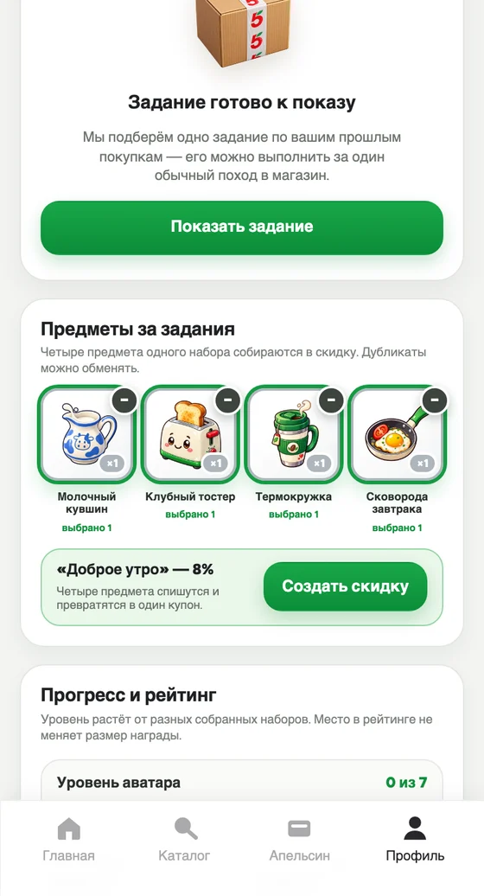

<div align="center">


# X5 Чекпоинт

### Собирай свою выгоду

Игра для приложения «Пятёрочки», в которой обычные покупки помогают собрать собственную скидку.<br/>
Пользователь получает цифровые кухонные предметы, находит тематические сочетания и выбирает интересную ему выгоду.

**Коробка → предмет → коллекция → четыре предмета → скидка**


<a href="https://github.com/m4themagics/x5-loyalty-system/actions/workflows/ci.yml"></a>


</div>

<div align="center">

| Открыть коробку | Собрать скидку |
| :---: | :---: |
|  |  |
| Коробка открывается встряхиванием — предмет попадает в инвентарь | Четыре предмета одного набора списываются в один купон |

</div>

## О проекте

В игре **24 предмета, три редкости и семь рецептов**. Например, тостер, молочный кувшин, термокружка и сковорода образуют «Доброе утро». Персональное задание помогает получить недостающий предмет; первый выполненный допустимый челлендж в целевой программе также приносит конкретный бесплатный товар.

Репозиторий содержит **локальный веб-прототип** с игровой песочницей и персональным сценарием на синтетических покупках. Товарные награды и погашение скидки демонстрационные.

## Экраны

<div align="center">

| Главная | Персональное задание | Награда |
| :---: | :---: | :---: |
|  |  |  |
| Знакомый интерфейс «Пятёрочки» | Условие, срок, награда и спонсор задания | Предмет с редкостью и набором |

| Четыре предмета | Активная скидка | Панель «Для X5» |
| :---: | :---: | :---: |
|  |  |  |
| Набор собран — можно создать купон | Купон с максимумом и демо-погашением | Экономика решения на синтетической когорте |

</div>

## Быстрый старт

Требуются **Bun 1.4.0** и **Python 3.9+** (`python3` в PATH). **Ollama** с локальной моделью `qwen3:1.7b` нужна только для живого LLM-заголовка; без неё работает проверенный шаблон.

```bash
git clone https://github.com/m4themagics/x5-loyalty-system.git
cd x5-loyalty-system
bun install --frozen-lockfile
```

Опционально включите локальную Qwen:

```bash
brew install ollama
brew services start ollama
ollama pull qwen3:1.7b
```

Запустите приложение:

```bash
bun --bun run --cwd webapp dev
```

Откройте **[localhost:5173](http://localhost:5173)** → **«Профиль»**. Если порт занят, используйте адрес из терминала. Для уже скачанного и установленного проекта достаточно последней команды.

Демо запускается без базы данных и облачного API-ключа. Vite сам вызывает Python, а карточку задания пишет локальная модель Qwen3 через Ollama. Если Ollama выключен, интерфейс продолжит работу с безопасным шаблоном. Остановить Vite можно через `Ctrl+C`. Персональные API доступны в режиме `dev`, а не в статической сборке.

<details>
<summary>macOS: терминал не находит Bun или Python</summary>

Для Bun в домашнем каталоге и Python из Homebrew:

```bash
PATH="/opt/homebrew/bin:$HOME/.bun/bin:$PATH" bun --bun run --cwd webapp dev
```

</details>

## Пройти демо

**Персональный сценарий** показывает связь покупок с коллекцией:

1. Нажмите **«Полный сброс демо»** и оставьте профиль **«Новый участник, пустой инвентарь»**.
2. Нажмите **«Показать задание»** — увидите заранее известные предмет и бесплатный SKU.
3. Отправьте **«Оплаченную покупку нужной категории»**, нажмите **«Забрать»**, затем откройте **«Для X5»**: там видны победившая Ads-кампания и один начисленный CPA.
4. Переключитесь на подготовленный профиль с тремя предметами «Доброго утра» и запросите следующее, уже органическое задание.
5. Проведите подходящий чек, получите сковороду и выберите четыре предмета в персональном инвентаре.
6. Нажмите **«Создать скидку»**, получите **8%** и попробуйте **«Погасить (демо)»**.

У пустого профиля первое задание приносит один предмет и демонстрационное право на товар. Подготовленный профиль позволяет сразу показать завершение рецепта. Переключение и перезагрузка сохраняют отдельный прогресс каждого синтетического профиля.

**Для маркетолога:** откройте **«Для X5»** в персональном сценарии. Экран показывает причины выбора и финансирование, затем результат сравнения политик, охват, диапазон пяти seed и CPA безубыточности после новых обязательств. Финансируемая политика явно помечена как результат симуляции.

**Игровая песочница** позволяет свободно открывать коробки: нажмите на коробку и встряхните её движением пальца или указателя по экрану. Соберите предметы, заполните четыре ячейки и создайте скидку со штрихкодом. Инвентарь песочницы отделён от персонального сценария.

Для обмена выберите **«Аня · обмен»** → отдайте кувшин за сковороду → **«Предложить обмен»**. Переключитесь на **«Борис · обмен»** → **«Принять обмен»**, затем вернитесь к Ане и соберите «Доброе утро» на 8%. Оба профиля явно подготовлены: дубликаты и два синтетических покупочных дня. Предложение живёт 24 часа; лимит — три завершённых обмена за последние семь дней. Зарезервированные копии недоступны для крафта.

[Прогон защиты на 4:50](docs/project/demo-runbook.md) · [короткие ответы](docs/project/demo-qa.md).

## Как это устроено

```
покупки  →  RecSys по правилам  →  Ads-аукцион  →  карточка от Qwen3  →  чек  →  предмет  →  4 предмета  →  скидка
```

| Компонент | Что делает |
| --- | --- |
| **React 19 · TypeScript · Vite · Tailwind CSS** | Игровой интерфейс, инвентарь и крафт; состояние хранится в браузере |
| **Python · RecSys по правилам** | В runtime выбирает одно задание по истории категорий и недостающим предметам, оценивает кандидатов и проверяет тестовый чек |
| **Python · Ads-аукцион** | Локально проводит quality-adjusted first-price CPA-аукцион между кампаниями, применяет фильтры и резервирует бюджет; после подтверждённого события выставляет один счёт |
| **Python · offline learned RecSys** | На рандомизированных синтетических логах обучает treatment/control logistic regression, калибрует uplift и отдельно оценивает billable-событие; в runtime эту модель пока не обслуживает |
| **Qwen3 1.7B · Ollama** | Локально предлагает заголовок уже выбранного задания; при недоступности модели возвращается проверенный шаблон |
| **Zod · JSON** | Контракт v2 между интерфейсом и Python, включая решение, событие и локальный Ads-ledger; вызов идёт через Vite middleware |

Каталог предметов и формула скидки остаются в игровых TypeScript-модулях. Python получает снимок каталога и игровые признаки. Локальный запуск ожидает Ollama на `127.0.0.1:11434` и модель `qwen3:1.7b`; адрес и модель можно заменить через `OLLAMA_URL` и `OLLAMA_MODEL`. Модель генерирует живой заголовок, а условие, срок, награда и спонсорство подставляются из проверенного решения — LLM не может изменить обещание. Облачный YandexGPT сохранён как необязательный запасной адаптер. [Подробнее о движке](recsys/engine/README.md).

## Статус и развитие

> Это учебный проект и **промежуточный результат**: работающий локальный прототип, а не продукт в эксплуатации.

Основной персональный путь, квалификация чеков, резервы, сохранение прогресса и Qwen/fallback-карточка проверены локально. Итоговая автоматизированная приёмка — **276 проверок**: 70 тестов движка, 39 аналитических, 24 контрактных, 127 web-тестов и **16 сквозных Playwright-сценариев**. Следующий шаг — 5–7 пользовательских прохождений, экспертная проверка задания, репетиция и резервная запись. Результаты и ограничения собраны в [статусе PoC](docs/project/poc-status.md).

Локальный обмен дубликатами уже позволяет завершить рецепт: Аня отдаёт лишний кувшин Борису и получает недостающую сковороду. Первый физический подарок в runtime выдаётся только через выигравшую рекламную кампанию; следующие циклы остаются цифровыми. Локальный Ads-контур конкурирует минимум двумя кампаниями в категориях молочных продуктов и кофе, учитывает качество, ожидаемый прирост, период, категорию, бюджет, частотный лимит и pacing, резервирует ставку вместе с субсидией и списывает first-price CPA ровно один раз после подтверждённого события. Ledger и панель живут в браузере и не являются промышленным биллингом.

В сравнении политик финансируемый первый подарок дал в среднем **+3 845,06 ₽ на когорту из 1 000 синтетических пользователей за четыре недели после обеспечения новых обязательств**, **5/5** положительных итогов при охвате **20,40%**. Это сильнее broad personalized **−7 996,44 ₽**, fixed dairy **+1 024,88 ₽** и reward-only **+3 436,90 ₽**; расчётная разница игры с reward-only **+408,16 ₽** опирается на явное синтетическое допущение об отклике. Отдельный offline learned RecSys на held-out дал **+18 665,20 ₽** против **+13 533,60 ₽** rules-baseline и **−6 790,60 ₽** fixed. Это воспроизводимые проверки реализации на синтетике, а не измеренный эффект X5. Реальная выдача, защищённый backend, POS, производственные аккаунты рекламодателей и обучение на фактических логах ещё не подключены; подробности приведены в [отчёте](recsys/eval/README.md).

## Документация

| Материал | Содержание |
| --- | --- |
| [Кейс X5](docs/project/case-brief.md) | Исходная задача и требования |
| [Описание проекта](docs/project/project-description.md) | Продуктовая концепция и целевые правила |
| [Предметы и рецепты](docs/project/item-pool.md) | Игровой каталог и сочетания |
| [Финальная презентация](docs/presentation/X5_Checkpoint_Своя_Пятёрочка_финальная.pptx) · [материалы защиты](docs/presentation/) | Семь слайдов защиты, описание решения и продуктовые материалы |
| [Контракт PoC](recsys/contract/README.md) · [оценка](recsys/eval/README.md) | Формат данных и синтетические проверки |
| [Статус PoC](docs/project/poc-status.md) | Проверенные сценарии, команды тестирования и ограничения текущей реализации |

Продуктовые документы включают также запланированные возможности. Для запуска и текущих границ реализации используйте этот README и статус PoC.

## Лицензия

[Apache 2.0](LICENSE). Названия и визуальные элементы «Пятёрочки» и X5 используются в учебном демонстрационном прототипе и принадлежат правообладателям.
