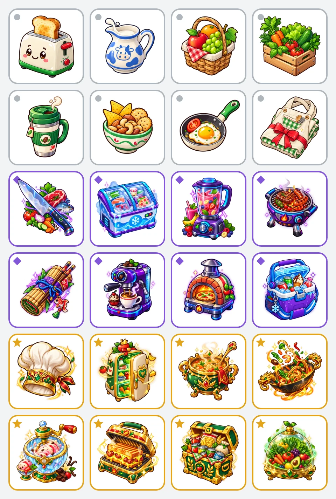

# Предметы, инвентарь и создание скидки

Этот документ подробно описывает **действующую игру коллег**: коробка → цифровой предмет → инвентарь → четыре предмета → собственная скидка → демонстрационный штрихкод. Каталог и расчёт уже используются веб-прототипом. Покупочные задания с гарантированной наградой, бесплатный физический товар, обмен и серверный учёт описаны отдельно в разделе о будущем контракте как следующая интеграция.

Источник фактического поведения — игровые модули, перечисленные в конце документа. Общее решение, экономика и правила будущих слоёв зафиксированы в [описании проекта](project-description.md) и [продуктовых материалах](product-materials.md).

## 1. Что представляет собой предмет

Предмет — цифровая игровая копия из каталога, которую можно положить в одну из четырёх ячеек создания скидки. Изображение тостера или холодильника не означает выдачу физического прибора. Физический товар за первый челлендж — отдельная награда.

У каждого вида предмета есть стабильный ID, название, редкость, категория, игровой текст и иконка. Один вид может храниться в нескольких копиях. Обычная копия даёт 1 очко силы, эпическая — 2, легендарная — 3.

Категория предмета используется для смешанной скидки, когда тематического рецепта недостаточно. У собранного рецепта собственная категория. Эти подписи пока являются демонстрационными категориями: связка с конкретными кассовыми SKU не подключена. Например, название «Любимые покупки» у Волшебного холодильника само по себе не означает, что состав этой категории уже персонализируется.

### Где пользователь видит информацию

| Экран | Что показывает |
| --- | --- |
| Получение из коробки | Иконку, название, редкость и прямое название категории |
| Сетка инвентаря | Иконку, визуальную редкость и количество доступных копий относительно общего количества |
| Карточка предмета | Крупную иконку, название, редкость и игровой намёк; прямую категорию в этой карточке не показывает |
| Незавершённая комбинация | Ближайший рецепт, число совпадений и иконки подходящих предметов |
| Четыре заполненные ячейки | Название будущей скидки, категорию, силу, бонус и итоговый процент |
| Созданная скидка | Итоговую категорию, процент, редкость и четыре использованные копии |

Таким образом, игровая загадка относится к карточке инвентаря. Категория раскрывается на других этапах взаимодействия.

## 2. Полный каталог: 24 предмета

Иконка каждого предмета находится по пути `webapp/public/assets/items/<id>.webp`. В каталоге по восемь предметов каждой редкости.

### Обычные — 1 очко за копию

| ID | Название | Категория | Текст карточки |
| --- | --- | --- | --- |
| `club-toaster` | Клубный тостер | Хлеб и выпечка | Любит хрустящие завтраки и аромат свежей булочной. |
| `milk-pitcher` | Молочный кувшин | Молочные продукты | Знает, что делает утро нежнее, а дверцу холодильника — привычнее. |
| `fruit-basket` | Фруктовая корзинка | Фрукты | Подсказывает заглянуть туда, где всегда ярко, сочно и по сезону. |
| `vegetable-crate` | Овощной ящик | Овощи и зелень | Собирает всё хрустящее, зелёное и будто только что с грядки. |
| `travel-mug` | Термокружка | Кофе и чай | Тянется к полкам, которые бодрят утром и согревают вечером. |
| `snack-bowl` | Миска для снеков | Снеки и орехи | Знает, чем занять руки во время фильма или встречи с друзьями. |
| `breakfast-pan` | Сковорода завтрака | Яйца и завтраки | Просыпается раньше всех и собирает быстрый сытный старт дня. |
| `baker-apron` | Фартук пекаря | Всё для выпечки | Ищет всё, что превращает домашнюю кухню в маленькую пекарню. |

### Эпические — 2 очка за копию

| ID | Название | Категория | Текст карточки |
| --- | --- | --- | --- |
| `chef-knife` | Нож шефа | Свежие продукты | Выбирает то, что лучше нарезать и приготовить сегодня, не откладывая. |
| `freezer-chest` | Морозильная камера | Замороженные продукты | Предпочитает запасы, которым не страшно долгое ожидание. |
| `power-blender` | Блендер здоровья | Полезные напитки | Любит яркие смеси, свежий вкус и заряд бодрости в стакане. |
| `master-grill` | Гриль мастера | Мясо и колбасы | Идёт туда, где продукту особенно идут огонь, корочка и дымок. |
| `sushi-kit` | Набор сушиста | Рыба и азиатская кухня | Собирает ингредиенты для ужина с палочками и соевым соусом. |
| `barista-machine` | Кофемашина бариста | Кофе и десерты | Понимает идеальную пару для ароматной чашки и маленькой сладкой паузы. |
| `pizza-oven` | Печь пиццайоло | Пицца и готовая еда | Спасает, когда хочется горячего ужина без долгой готовки. |
| `picnic-cooler` | Холодильник для пикника | Холодные напитки и мороженое | Берёт всё, что приятно открыть холодным на прогулке или в жаркий день. |

### Легендарные — 3 очка за копию

| ID | Название | Категория | Текст карточки |
| --- | --- | --- | --- |
| `golden-chef-hat` | Золотой колпак повара | Готовая еда | Знает короткий путь к полноценному обеду, когда готовить совсем некогда. |
| `magic-fridge` | Волшебный холодильник | Любимые покупки | Запоминает то, за чем вы возвращаетесь снова и снова. |
| `royal-cauldron` | Королевский казан | Крупы, супы и соусы | Собирает основу для тёплого домашнего блюда в одной большой кастрюле. |
| `dragon-wok` | Драконий вок | Лапша и азиатская кухня | Любит острое, пряное и то, что удобнее есть палочками. |
| `crystal-icecream-maker` | Кристальная мороженица | Мороженое и десерты | Ищет самый холодный способ сделать обычный день слаще. |
| `legendary-sandwich-press` | Пресс идеального сэндвича | Хлеб, сыр и колбасы | Соединяет хрустящую основу, нежную середину и сытную начинку. |
| `treasure-pantry` | Сундук запасов | Бакалея и консервы | Ценит то, что всегда выручает и долго ждёт своего часа. |
| `freshness-dome` | Купол свежести | Овощи, фрукты и зелень | Тянется к самым ярким цветам и хрусту прямо с грядки. |

## 3. Коробка и получение предмета

### Сценарий действующего демо

1. Пользователь нажимает на коробку в профиле.
2. В открывшемся экране зажимает коробку и двигает пальцем или мышью по экрану.
3. После достаточного движения начинается анимация открытия.
4. Через 1,4 секунды выбирается случайный предмет и автоматически добавляется в инвентарь.
5. Пользователь видит результат и нажимает «Забрать», чтобы закрыть экран. Начисление уже состоялось до этого нажатия.
6. Следующую коробку можно открыть сразу.

Жест использует координаты указателя, а не датчики движения телефона. Для открытия накапливается 620 пикселей перемещения; один сегмент даёт не более 90 пикселей. Отпускание пальца прекращает текущее движение, но не обнуляет накопленный прогресс этого открытия.

В интерфейсе явно показаны «Демо-режим» и «Без лимита». Сохранённый старый таймер ожидания не ограничивает действующую коробку: при открытии профиля состояние приводится к доступной коробке. Это способ быстро показать игру, а не правило выдачи материальных наград за покупки.

### Вероятности

Каждое открытие сначала выбирает редкость, затем равномерно один из восьми предметов этой редкости.

| Редкость | Вероятность редкости | Предметов | Вероятность конкретного предмета |
| --- | ---: | ---: | ---: |
| Обычная | 70% | 8 | 8,75% |
| Эпическая | 25% | 8 | 3,125% |
| Легендарная | 5% | 8 | 0,625% |

Используется локальный случайный выбор. История покупок, уже имеющиеся предметы и незавершённые рецепты сейчас на него не влияют. Нет исключения повторов, гарантии легендарного предмета после серии открытий или гарантированного нового предмета. Один и тот же предмет может выпасть несколько раз подряд.

### Задания на текущем экране

| Статическая карточка | Показанный прогресс | Показанная награда |
| --- | --- | --- |
| Купите 5 напитков «Добрый» | 2 из 5 | Одна коробка |
| Купите 3 готовых блюда «Рестория» | 1 из 3 | Одна коробка |
| Купите овощи или фрукты 3 раза | 2 из 3 | Одна коробка |
| Купите молочные продукты 2 раза | 0 из 2 | Одна коробка |

Карточки объединены заголовком «Задания недели» и отметкой «7 дней». Покупочные события не обновляют этот прогресс и не выдают коробки: связь с чеком относится к следующей интеграции.

## 4. Инвентарь и четыре ячейки

### Количество и хранение

Инвентарь хранит пары `itemId` и `quantity`. Первое получение создаёт позицию с одной копией; повтор увеличивает её количество. Дубликат не занимает отдельную клетку сетки.

Счётчик вида «5/24» означает пять разных видов предметов, **сейчас имеющихся в инвентаре**. Это не число всех копий и не история когда-либо собранной коллекции. Если последняя копия вида потрачена, позиция исчезает и счётчик уменьшается. Сетка показывает минимум восемь клеток и расширяется при росте количества разных предметов.

Инвентарь сохраняется в `localStorage` браузера с версией формата 1. При восстановлении:

- отсутствующая запись, неверный JSON или неподдерживаемая версия дают пустой инвентарь;
- неизвестный ID, нецелое, нулевое или отрицательное количество пропускаются;
- несколько сохранённых записей одного ID объединяются суммированием.

Это проверка формата локальных данных. Серверной проверки владения копиями, синхронизации между устройствами и защиты от ручной подмены количества пока нет.

### Выбор и отмена

Ровно четыре слота используются для создания одной скидки. Заполнить их можно двумя способами: перетащить предмет мышью или пальцем; либо открыть его карточку, нажать «Выбрать предмет» и затем нажать на слот.

На каждой позиции инвентаря показано **доступно / всего**. Если из трёх копий одна помещена в слот, остаётся «2/3». Размещение временно уменьшает доступность внутри текущего экрана, но ещё не списывает предмет из сохранённого инвентаря.

| Действие | Поведение |
| --- | --- |
| Положить имеющуюся копию в пустой слот | Слот заполняется, доступность уменьшается на одну |
| Нажать на заполненный слот без выбранного предмета | Слот очищается, копия снова доступна |
| Поместить другой доступный предмет в заполненный слот | Содержимое заменяется, предыдущая копия освобождается |
| Повторно поместить тот же ID в тот же слот | Ничего не меняется |
| Попытаться использовать больше копий, чем есть | Размещение не выполняется; функция окончательного списания также отклоняет нехватку |
| Нажать на предмет, все копии которого уже размещены | Карточку можно посмотреть; кнопка выбора недоступна |
| Заполнить меньше четырёх слотов | Кнопка создания недоступна и сообщает, сколько копий добавить |
| Создать скидку из четырёх слотов | По одной копии каждого слота расходуется; слоты очищаются |

Повтор одного ID в разных слотах допустим при достаточном количестве копий. Например, две копии тостера требуют количества не менее двух. Незавершённые слоты хранятся только в состоянии экрана и не являются долговечным серверным резервом.

## 5. Все семь рецептов

Рецепт — список подходящих видов предметов, а не единственная фиксированная четвёрка. Для бонуса достаточно трёх разных совпадений; четыре разных совпадения усиливают бонус. Четвёртый предмет в наборе с тремя совпадениями может относиться к другой теме.

| Порядок и ID | Рецепт | Категория результата | Полный состав подходящих предметов |
| --- | --- | --- | --- |
| 1. `breakfast` | Доброе утро | Завтраки, выпечка и горячие напитки | Клубный тостер; Молочный кувшин; Термокружка; Сковорода завтрака; Кофемашина бариста; Фартук пекаря; Фруктовая корзинка |
| 2. `fresh` | Свежий выбор | Овощи, фрукты и полезные продукты | Фруктовая корзинка; Овощной ящик; Блендер здоровья; Купол свежести; Молочный кувшин; Сковорода завтрака |
| 3. `movie` | Вечер без готовки | Снеки, напитки и готовая еда | Миска для снеков; Печь пиццайоло; Холодильник для пикника; Пресс идеального сэндвича; Морозильная камера |
| 4. `asian` | Азиатский ужин | Рыба, рис, лапша и азиатские соусы | Набор сушиста; Драконий вок; Королевский казан; Нож шефа; Овощной ящик; Сундук запасов |
| 5. `chef` | Ужин шефа | Мясо, свежие продукты и кулинария | Нож шефа; Гриль мастера; Золотой колпак повара; Овощной ящик; Волшебный холодильник; Королевский казан |
| 6. `dessert` | Сладкая пауза | Десерты, кофе и всё для выпечки | Фартук пекаря; Кофемашина бариста; Кристальная мороженица; Молочный кувшин; Фруктовая корзинка; Термокружка |
| 7. `pantry` | Домашний запас | Бакалея, заморозка и продукты долгого хранения | Сундук запасов; Морозильная камера; Волшебный холодильник; Холодильник для пикника; Клубный тостер; Пресс идеального сэндвича |

Один предмет может подходить нескольким рецептам. Для результата выбирается рецепт с наибольшим числом **разных ID**, совпавших с выбранными слотами. При равенстве побеждает первый по порядку таблицы: «Доброе утро», затем «Свежий выбор» и далее.

### Подсказка ближайшего рецепта

При пустых слотах интерфейс предлагает Клубный тостер, Молочный кувшин и Термокружку. После первого выбора он находит ближайший рецепт по числу уникальных совпадений и предлагает ещё не выбранные предметы из списка этого рецепта в каталожном порядке.

Подсказка не проверяет наличие предложенных копий в инвентаре и не оптимизирует будущий процент или экономику. Покупочная история не участвует. Это действующая игровая подсказка; будущий RecSys будет решать отдельную задачу выбора полезного задания и награды.

## 6. Точный расчёт скидки

### Шаг 1. Сумма силы всех четырёх копий

Каждая копия учитывается независимо: обычная даёт 1, эпическая — 2, легендарная — 3. Поэтому сумма составляет от 4 до 12, даже если все четыре копии одинаковы.

| Сила набора | Базовая скидка |
| ---: | ---: |
| 4–5 | 5% |
| 6–7 | 7% |
| 8–9 | 10% |
| 10–11 | 13% |
| 12 | 15% |

### Шаг 2. Один тематический бонус

| Разных совпадений с выбранным рецептом | Бонус |
| ---: | ---: |
| 0–2 | 0 процентных пунктов |
| 3 | +2 процентных пункта |
| 4 | +3 процентных пункта |

Дубликаты усиливают базу за счёт своей редкости, но для совпадений считаются одним видом. Бонусы нескольких рецептов не суммируются.

### Шаг 3. Название, категория и итог

При трёх или четырёх уникальных совпадениях используются название и категория выбранного рецепта. При меньшем числе совпадений получается смешанный набор без бонуса: категория самого редкого выбранного предмета, название «Скидка на …». Если самых редких предметов несколько, действует первый в порядке слотов; перестановка такого смешанного набора может изменить категорию.

Итоговый процент — базовая скидка плюс тематический бонус, с программным потолком **18%**. В действующем каталоге достижимый максимум — **17%**: ни один рецепт не содержит четырёх разных легендарных предметов, которые одновременно дали бы 15% базы и 3 процентных пункта бонуса. Проверка всех 17 550 возможных наборов из четырёх копий с повторами подтверждает этот максимум.

Редкость готовой скидки рассчитывается отдельно от её процента:

| Сила набора | Редкость скидки |
| ---: | --- |
| 4–6 | Обычная |
| 7–9 | Эпическая |
| 10–12 | Легендарная |

### Примеры, которые можно воспроизвести

| Четыре выбранные копии | Сила | Совпадения и бонус | Итог |
| --- | ---: | --- | --- |
| Клубный тостер + Молочный кувшин + Термокружка + Сковорода завтрака | 4 | Четыре разных в «Добром утре»: +3 п.п. | **8%**, «Доброе утро», обычная |
| Фруктовая корзинка + Овощной ящик + Блендер здоровья + Купол свежести | 7 | Четыре разных в «Свежем выборе»: +3 п.п. | **10%**, «Свежий выбор», эпическая |
| Золотой колпак повара ×2 + Волшебный холодильник + Королевский казан | 12 | Три разных в «Ужине шефа»: +2 п.п. | **17%**, «Ужин шефа», легендарная |
| Фруктовая корзинка ×4 | 4 | Один разный предмет: без бонуса | **5%** на фрукты, обычная |

Редкий предмет полезен для силы, а разнообразие — для тематического бонуса. Эти два свойства создают выбор: использовать имеющиеся копии сейчас или продолжить собирать нужную комбинацию.

## 7. Результат, активная скидка и ограничения демо

После создания по одной копии каждого слота расходуется. Если количество вида становится нулевым, его позиция удаляется из инвентаря. Открывается результат с названием, процентом, категорией, редкостью, использованными предметами и бонусом.

Рядом с персонажем появляется значок активной скидки. Нажатие на него или на кнопку «Показать штрихкод» открывает EAN-13. Код имеет 13 цифр, корректную контрольную цифру и графическое кодирование; он формируется локально и не зарегистрирован в кассовой системе.

В браузере хранится **одна активная скидка**. Создание новой заменяет предыдущую без отдельного подтверждения; ранее потраченные предметы при этом не возвращаются. После перезагрузки активная скидка восстанавливается из отдельной записи `localStorage`.

| Область | Текущее поведение и граница готовности |
| --- | --- |
| Проверка сохранённой скидки | Проверяются формат, четыре известных ID, типы полей и контрольная цифра EAN-13; расчёт процента и категории по предметам заново не выполняется |
| Списание и выдача | Инвентарь и скидка записываются раздельно в браузере; единой защищённой серверной транзакции нет |
| Владение и синхронизация | Нет проверки владельца предметов и общей синхронизации между вкладками или устройствами |
| Ошибка хранения | Повреждённое содержимое обрабатывается при чтении; отдельное восстановление после отказа записи `localStorage` не реализовано |
| Погашение | Нет кассового подтверждения, одноразового серверного списания или гарантии глобальной уникальности кода |
| Условия скидки | Не подключены срок действия, рублёвый лимит, допустимая база покупки, точный состав SKU и правила сочетания с другими акциями |
| Экономия | Процент и демонстрационный штрихкод не подтверждают фактически сэкономленные рубли |
| Персонаж | В профиле показан статичный игровой персонаж; изменение внешности, уровни и рейтинг этим экраном не реализованы |
| Социальные действия | Передачи и обмена предметами в действующем интерфейсе нет |

Эти ограничения описывают фактический статус прототипа. Они не меняют согласованный целевой контракт: заработанные права и обещанные награды должны сохраняться.

## 8. Подключение к финальному продукту: будущий контракт

Следующая интеграция сохраняет эти 24 предмета, семь рецептов и взаимодействие с четырьмя слотами. RecSys выбирает одно допустимое задание и полезный цифровой предмет из того же каталога. Сервер фиксирует обещанный ID **до показа задания**; после подтверждённого события та же коробка раскрывает уже назначенный предмет. Случайные вероятности демо 70/25/5 не могут заменить это обещание.

После первого показанного, допустимого и выполненного челленджа пользователь получает также **один полный бесплатный физический SKU**. Это отдельное обязательство, а не обмен цифрового тостера на бытовую технику и не скидка вместо товара. Условия, конкретный товар, наличие и финансирование известны до показа.

Если инвентарь изначально пуст, первое задание даёт **один цифровой предмет из необходимых четырёх**. После подтверждения первого задания пользователь получает право на обещанный физический товар; сборка скидки требует дальнейших начислений. Демонстрация немедленного крафта должна явно использовать профиль с тремя ранее полученными копиями; скрытое стартовое начисление трёх предметов в продукте не предусмотрено.

Для интеграции необходимы:

- серверный учёт выдачи, владельца, доступного количества, резервов и списания с уникальными идентификаторами операций;
- сохранение версии каталога, рецепта и условий выданной скидки, чтобы изменения правил не меняли уже показанное обещание;
- полный резерв максимальных обязательств физической награды и будущей скидки до показа; цифровые предметы также могут увеличивать стоимость будущих погашений;
- атомарное создание скидки со списанием четырёх копий и проверкой текущего количества;
- прямой обмен дубликатов один к одному одинаковой редкости: 24 часа, подтверждение обеих сторон, резерв и атомарная передача, не более трёх завершённых обменов за неделю и минимум два подтверждённых покупочных дня у каждого участника;
- проверка дополнительной стоимости после обмена: равная редкость не означает одинаковую вероятность завершения рецепта и погашения скидки;
- точные SKU, срок, лимит суммы скидки, правила применения и одноразовое кассовое погашение, а также сохранение уже заработанных прав при отсутствии нового задания.

Физические товары, купоны, активные скидки и ещё не выданные награды не передаются. Обмен не начисляет отдельного бонуса. В повторных циклах конкретный бесплатный SKU может быть заранее показанной целью обеспеченного рецепта. Четыре копии используются на один результат — обычную скидку либо обещанный товар; за каждое задание товар не выдаётся.

Товарная цель не меняет существующую формулу: используются те же четыре доступные копии и тот же алгоритм выбора тематического рецепта с бонусом. Для получения SKU результат должен совпасть с рецептом активной обеспеченной цели. Четыре одинаковые копии не закрывают тематическую товарную цель. Сервер однократно списывает четыре экземпляра и создаёт право на конкретный товар; повтор запроса не выдаёт второй SKU и не создаёт купон на те же копии.

Первый подарок по заданию выдаётся отдельно и не требует крафта. Одновременно обещанные первый подарок и товар за рецепт — два обязательства. Для цели заранее резервируется полный SKU, отдельно сохраняются купонные резервы экземпляров. При выборе товара купонные резервы четырёх потраченных экземпляров освобождаются, резерв SKU переходит на право выдачи. Обычный крафт не отменяет цель автоматически. Наличие активного купона блокирует только новый купон, а не отдельное товарное право. Подробные состояния, сроки и исключения — раздел 4.4 [финального плана](project-description.md).

Это спецификация следующей реализации. Действующие JSON-схемы, фикстуры и runtime-код этим документом не расширяются. Полные правила финансирования, Ads, антифрода и приёмки: [описание проекта](project-description.md), [план RecSys/Ads](../../recsys/PLAN.md), [план работ](plan.md).

## 9. Источники реализации и существующие проверки

| Правила | Источник |
| --- | --- |
| Каталог, ID, категории и описания | [profile-items.ts](../../webapp/src/features/home/profile-items.ts) |
| Вероятности и случайный выбор | [profile-item-drop.ts](../../webapp/src/features/home/profile-item-drop.ts) |
| Жест открытия | [profile-chest-gesture.ts](../../webapp/src/features/home/profile-chest-gesture.ts) |
| Количество, списание и восстановление инвентаря | [profile-inventory.ts](../../webapp/src/features/home/profile-inventory.ts) |
| Рецепты, подсказки, формула и восстановление скидки | [profile-discount-crafting.ts](../../webapp/src/features/home/profile-discount-crafting.ts) |
| Четыре слота и карточки инвентаря | [ProfileInventoryCrafting.tsx](../../webapp/src/features/home/ProfileInventoryCrafting.tsx) |
| Коробка, задания, сохранение и одна активная скидка | [ProfileScreen.tsx](../../webapp/src/features/home/ProfileScreen.tsx) |
| EAN-13 и показ результата | [profile-barcode.ts](../../webapp/src/features/home/profile-barcode.ts), [ProfileDiscount.tsx](../../webapp/src/features/home/ProfileDiscount.tsx) |

В репозитории есть модульные проверки каталога, вероятностных границ, дубликатов, сериализации, нехватки копий и создания скидки: [tests](../../webapp/tests). Браузерный сценарий проверяет открытие коробки и сборку с восстановлением штрихкода: [profile-navigation.spec.ts](../../webapp/e2e/demo/profile-navigation.spec.ts). Наличие этих проверок не означает реализованных чеков, антифрода, экономики или обмена.
